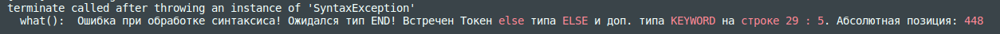
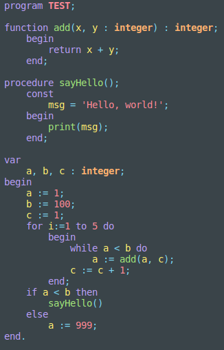
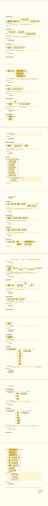
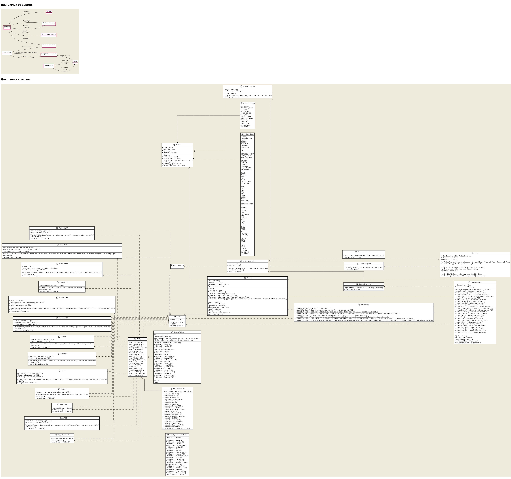

# micro-Pascal

<div align="right">
  
[](https://github.com/DanArmor/micro-Pascal/actions/workflows/main.yaml)
[](https://www.codacy.com/gh/DanArmor/micro-Pascal/dashboard?utm_source=github.com&amp;utm_medium=referral&amp;utm_content=DanArmor/micro-Pascal&amp;utm_campaign=Badge_Grade)
[](https://github.com/DanArmor/micro-Pascal/actions/workflows/c-cpp.yml)
[](https://github.com/DanArmor/micro-Pascal/actions/workflows/draw.yml)
  
</div>

Синт. анализатор, который формирует абстрактное дерево синтаксиса по коду на языке Pascal (пока что?)

Состоит из:
* Лексера - разбивате на токены полученную программу
* Синтаксического анализатора - из токенов формирует дерево программы
* Различные посетители (наследники IVisitor) - обходят дерево, выполняя какую-то задачу (Например, GraphizVisitor формирует изображения деревьев, как ниже. Другие примеры вы можете увидеть в этой ветке https://github.com/DanArmor/micro-Pascal/tree/treeImg)


Текст программы, по которому построено дерево:
```Pascal
program TEST;
    
function add(x, y : integer) : integer;
    begin
        return x + y;
    end;

procedure sayHello();
    const
        msg = 'Hello, world!';
    begin
        print(msg);
    end;

var
    a, b, c : integer;
begin
    a := 1;
    b := 100;
    c := 1;
    for i:=1 to 5 do
        begin
            while a < b do
                a := add(a, c);
            c := c + 1;
        end;
    if a < b then
        sayHello()
    else
        a := 999;
end.
```

Если поставить точку с запятой после sayHello() внутри if в конце программы (В Pascal её нельзя ставить перед else), то анализатор сообщит об этом:


Так же, добавляя новых посетителей можно расширять функционал. Например, добавить подсветку:


И так далее. 

### Структура


* side_include - различные сторонние библиотеки
* include - мои заголовочные файлы
* src - сурсы для классов и т. п.
* schemes - объектная схема и диаграмма классов (не всегда актуальные на данный момент)
* progs - тексты программ для ручного запуска и проверки
* tests - тесты, имеющие свои тексты для проверок
* examples - для Doxygen, попытка добавить примеры кода для документации

К большей части кода есть doxy комменты, поэтому подкорректировав Doxyfile можно собрать документацию к проекту. (А так же в VSCode и других редакторах за счет этого более хорошие подсказки по параметрам и т. п.)

https://danarmor.github.io/micro-Pascal/ - ссылка на актуальную документацию - собирается при каждом пуше.

### Что используется из стороннего?
* magic_enum.hpp - для получения имен энамов в рантайме (https://github.com/Neargye/magic_enum)
* plantUML - для написания объектной схемы и схемы классов (https://github.com/plantuml/plantuml)
* https://gitlab.com/graphviz/graphviz - для отрисовски дерева синтаксиса
* Doxygen - документация (https://github.com/doxygen/doxygen)
* Doxygen Awesome - стиль для документации (https://jothepro.github.io/doxygen-awesome-css/)
* https://bottlecaps.de/rr/ui - для написания схем синтаксиса ([Форма Бэкуса-Наура](https://ru.wikipedia.org/wiki/%D0%A4%D0%BE%D1%80%D0%BC%D0%B0_%D0%91%D1%8D%D0%BA%D1%83%D1%81%D0%B0_%E2%80%94_%D0%9D%D0%B0%D1%83%D1%80%D0%B0))
* https://products.aspose.app/words/conversion/xhtml-to-svg - превращать выходные .xhtml от синт.схем по ссылке выше в .svg
* https://valgrind.org/ - для проверок на утечки памяти
* Google tests - тестирование (https://github.com/google/googletest)
* https://codacy.com/ - анализ кода

### Синтаксические диаграммы:


### Диаграмма объектов и диаграмма классов:

