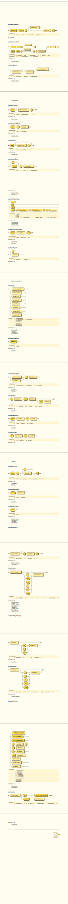
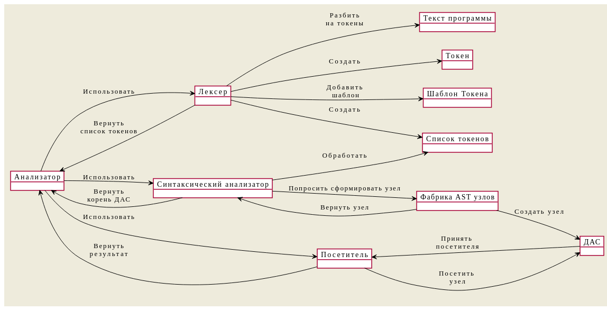

# micro-Pascal

  

  

Синт. анализатор, который формирует абстрактное дерево синтаксиса по коду на языке Pascal.
Состоит из:
* Лексера - разбивате на токены полученную программу
* Синтаксического анализатора - из токенов формирует дерево программы
* Различные посетители (наследники IVisitor) - обходят дерево, выполняя какую-то задачу (Например, GraphizVisitor формирует изображения деревьев, как ниже. Другие примеры вы можете увидеть в этой ветке https://github.com/DanArmor/micro-Pascal/tree/treeImg)

Текст программы, по которому построено дерево:

Если поставить точку с запятой после sayHello() внутри if в конце программы (В Pascal её нельзя ставить перед else), то анализатор сообщит об этом:

И так далее. 

### Структура

* side_include - различные сторонние библиотеки
* include - мои заголовочные файлы
* src - сурсы для классов и т. п.
* schemes - объектная схема и диаграмма классов (не всегда актуальные на данный момент)
* progs - тексты программ для ручного запуска и проверки
* tests - тесты, имеющие свои тексты для проверок
* examples - для Doxygen, попытка добавить примеры кода для документации

К большей части кода есть doxy комменты, поэтому подкорректировав Doxyfile можно собрать документацию к проекту. (А так же в VSCode и других редакторах за счет этого более хорошие подсказки по параметрам и т. п.)

https://danarmor.github.io/micro-Pascal/ - ссылка на актуальную документацию - собирается при каждом пуше.

### Что используется из стороннего?
* [magic_enum.hpp](https://github.com/Neargye/magic_enum) - для получения имен энамов в рантайме 
* [plantUML](https://github.com/plantuml/plantuml) - для написания объектной схемы и схемы классов 
* [Graphviz](https://gitlab.com/graphviz/graphviz) - для отрисовски дерева синтаксиса
* [Doxygen](https://github.com/doxygen/doxygen) - документация 
* [Doxygen Awesome](https://jothepro.github.io/doxygen-awesome-css/) - стиль для документации 
* https://bottlecaps.de/rr/ui - для написания схем синтаксиса ([Форма Бэкуса-Наура](https://ru.wikipedia.org/wiki/%D0%A4%D0%BE%D1%80%D0%BC%D0%B0_%D0%91%D1%8D%D0%BA%D1%83%D1%81%D0%B0_%E2%80%94_%D0%9D%D0%B0%D1%83%D1%80%D0%B0))
* https://products.aspose.app/words/conversion/xhtml-to-svg - превращать выходные .xhtml от синт.схем по ссылке выше в .svg
* [Valgrind](https://valgrind.org/) - для проверок на утечки памяти
* [Google tests](https://github.com/google/googletest) - тестирование
* [Codacy](https://codacy.com/) - анализ кода

### Синтаксические диаграммы:

### Диаграмма объектов и диаграмма классов:

