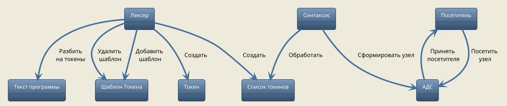
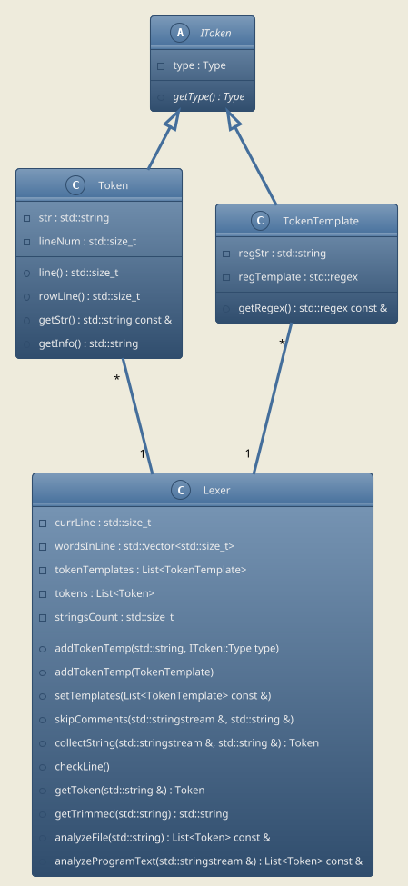

## Диаграмма объектов.

```plantuml
@startuml
    !theme spacelab
    skinparam backgroundColor #EEEBDC
    skinparam handwritten false
    skinparam arrowFontColor black

    object "Лексер" as Lexer
    object "Текст программы" as Text
    object "Синтаксис" as Syntax
    object "Список токенов" as List
    object "АДС" as AST
    object "Посетитель" as Visitor

    object "Токен" as Token
    object "Шаблон Токена" as TokenTemp

    Lexer --> TokenTemp : "Добавить\n шаблон"
    Lexer --> TokenTemp : "Удалить\n шаблон"
    Lexer --> Text : "Разбить\nна токены"
    Lexer --> List : "Создать"
    Lexer --> Token : "Создать"

    Syntax --> List : "Обработать"
    Syntax --> AST : "Сформировать узел"

    Visitor --> AST : "Посетить \nузел"
    Visitor <-- AST : "Принять \nпосетителя"
@enduml
```

```plantuml
@startuml
    !theme spacelab
    skinparam backgroundColor #EEEBDC
    skinparam handwritten false
    skinparam arrowFontColor black

    abstract "IToken" as IToken {
        -type : Type
        + {abstract} getType() : Type
    }

    class "Token" as Token{
        +line() : std::size_t
        + rowLine() : std::size_t
        + getStr() : std::string const &
        + getInfo() : std::string
        -str : std::string
        -lineNum : std::size_t
    }

    class "TokenTemplate" as TokenTemp{
        + getRegex() : std::regex const &
        -regStr : std::string
        -regTemplate : std::regex
    }

    class "Lexer" as Lexer {
        +addTokenTemp(std::string, IToken::Type type)
        +addTokenTemp(TokenTemplate)
        +setTemplates(List<TokenTemplate> const &)
        +skipComments(std::stringstream &, std::string &)
        +collectString(std::stringstream &, std::string &) : Token
        +checkLine()
        +getToken(std::string &) : Token
        +getTrimmed(std::string) : std::string
        +analyzeFile(std::string) : List<Token> const &
        +analyzeProgramText(std::stringstream &) : List<Token> const &
        -currLine : std::size_t
        -wordsInLine : std::vector<std::size_t>
        -tokenTemplates : List<TokenTemplate>
        -tokens : List<Token>
        -stringsCount : std::size_t
    }

    IToken <|-- Token
    IToken <|-- TokenTemp

    TokenTemp "*" --- "1" Lexer
    Token "*" --- "1" Lexer
@enduml
```