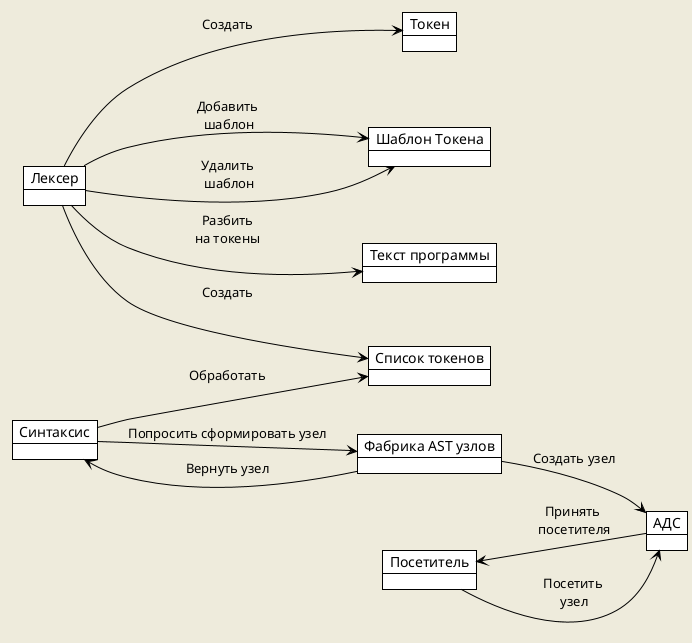

## Диаграмма объектов.

```plantuml
@startuml
    !theme plain
    skinparam backgroundColor #EEEBDC
    skinparam handwritten false
    skinparam arrowFontColor black
    left to right direction

    object "Лексер" as Lexer
    object "Текст программы" as Text
    object "Синтаксис" as Syntax
    object "Список токенов" as List
    object "АДС" as AST
    object "Посетитель" as Visitor

    object "Токен" as Token
    object "Шаблон Токена" as TokenTemp

    object "Фабрика AST узлов" as ASTFactory

    Lexer --> TokenTemp : "Добавить\n шаблон"
    Lexer --> TokenTemp : "Удалить\n шаблон"
    Lexer --> Text : "Разбить\nна токены"
    Lexer --> List : "Создать"
    Lexer --> Token : "Создать"

    Syntax --> List : "Обработать"
    Syntax --> ASTFactory : "Попросить сформировать узел"
    ASTFactory --> AST : "Создать узел"
    ASTFactory --> Syntax : "Вернуть узел"

    Visitor --> AST : "Посетить \nузел"
    Visitor <-- AST : "Принять \nпосетителя"
@enduml
```

## Диаграмма классов:

```plantuml
@startuml
    !theme plain
    skinparam backgroundColor #EEEBDC
    skinparam handwritten false
    skinparam arrowFontColor black
    skinparam groupInheritance 9
    skinparam linetype ortho
    left to right direction
    

    abstract "IToken" as IToken {
        -{static}Type : enum
        -{static}AdvType : enum
        -type : Type
        -advType : AdvType
        + IToken()
        + IToken(type : Type)
        + IToken(type : AdvType)
        + IToken(type : Type, advType : AdvType)
        + {abstract} getType() : Type
        + {abstract} getAdvType() : AdvType
        + {abstract} setAdvType(type : AdvType)
    }
    enum "IToken::AdvType" as TokenAdvType{
        KEYWORD,
        FUNCTION_NAME,
        VAR_NAME,
        OPERATOR,
        SOME_CONST,
        TYPE_SPEC,
        NOTPROCESS,
        PROGRAM_NAME,
        SELECT,
        VARDECL,
        CONSTDECL,
        COMPOUND,
        UNKNOWN
    }

    enum "IToken::Type" as TokenType{
        ERROR,
        ENDOFSTREAM,
        EMPTY,
        BLOCK,
        NEWLINE,
        COMMENT,

        ID, 

        INTEGER_CONST,
        REAL_CONST,
        STRING_CONST,

        LPAREN,
        RPAREN,
        LBRACE,
        RBRACE,
        LSQBRACKET,
        RSQBRACKET,

        PLUS,
        MINUS,
        MUL,
        MOD,
        INTEGER_DIV,
        FLOAT_DIV,

        AND,
        NOT,
        OR,
        EQ,
        NEQ,
        LESS,
        LESS_EQ,
        MORE,
        MORE_EQ,

        STRING_BOUND,

        ASSIGN,

        BEGIN,
        END,
        PROGRAM,
        VAR,
        CONST,
        WHILE,
        FOR,
        DO,
        IF,
        THEN,
        ELSE,
        DOWN,
        TO,
        DOWNTO,
        RETURN,
        ARRAY,
        OF,
        FUNCTION,
        PROCEDURE,
        RANGE,

        INTEGER,
        REAL,
        STRING,
        VOID,

        DOT,
        SEMI, 
        COLON,
        COMMA, 
    }

    class "Token" as Token{
        +Token()
        +Token(str : std::string const &, type : Type const, advType : AdvType const)
        +Token(str : std::string const&, type : Type const, lineNum : std::size_t const, inLinePosNum : std::size_t const, inFilePos : std::size_t const)

        +line() : std::size_t
        +rawLine() : std::size_t
        +posInLine() : std::size_t
        +rawPosInLine() : std::size_t
        +pos() : std::size_t
        +len() : std::size_t
        + getStr() : std::string const &
        + getInfo() : std::string
        -str : std::string
        -lineNum : std::size_t
        -posInLineNum : std::size_t
        -posNum : std::size_t
    }

    class "TokenTemplate" as TokenTemp{
        +TokenTemplate()
        +TokenTemplate(str : std::string, type : Type, advType : AdvType)
        + getRegex() : std::regex const &
        -regStr : std::string
        -regTemplate : std::regex
    }

    class "Lexer" as Lexer {
        +addTokenTemp(regStr : std::string const &, type : IToken::Type, advType : IToken::AdvType)
        +addTokenTemp(tokenTemp : TokenTemplate const &)

        +setTemplates(templates : List<TokenTemplate> const &)
        +getTrimmed(str : std::string const &) : std::string
        +getText() : std::string

        +analyzeFile(fileName : std::string const &) : List<Token>
        +analyzeProgramText(text : std::string const &) : List<Token>
        -tokenTemplates : List<TokenTemplate>
        -tokens : List<Token>
        -progText : std::string
    }

    abstract "AST" as AST {
        +AST(token : Token)
        +{abstract}~AST()
        +{abstract}accept(IVisitor &)
        +token : Token
    }

    abstract "IVisitor" as IVisitor {
        +{abstract} visit(ProgramAST &)
        +{abstract} visit(FunctionAST &)
        +{abstract} visit(BlockAST &)
        +{abstract} visit(VarDeclAST &)
        +{abstract} visit(TypeSpecAST &)
        +{abstract} visit(ArrSpecAST &)
        +{abstract} visit(ConstAST &)
        +{abstract} visit(CompoundAST &)
        +{abstract} visit(NumberAST &)
        +{abstract} visit(StringAST &)
        +{abstract} visit(BinOpAST &)
        +{abstract} visit(UnOpAST &)
        +{abstract} visit(NoOpAST &)
        +{abstract} visit(AssignAST &)
        +{abstract} visit(VarAST &)
        +{abstract} visit(SelectAST &)
        +{abstract} visit(CallAST &)
        +{abstract} visit(ReturnAST &)
        +{abstract} visit(IfAST &)
        +{abstract} visit(WhileAST &)
        +{abstract} visit(ForAST &)
        +{abstract} visit(IterationAST &)
    }

    class "SyntaxAnalyzer" as Syntax {
        +SyntaxAnalyzer(tokens : List<Token> const &)
        +parseTokens() : std::unique_ptr<AST>
        +syntaxProgram() : std::unique_ptr<AST>
        +syntaxCompoundSt() : std::unique_ptr<AST>
        +syntaxStList() : std::vector<std::unique_ptr<AST>>
        +syntaxSt() : std::unique_ptr<AST>
        +syntaxAssignSt() : std::unique_ptr<AST>
        +syntaxVariable() : std::unique_ptr<AST>
        +syntaxEmptySt() : std::unique_ptr<AST>
        +syntaxBlock() : std::unique_ptr<AST>
        +syntaxVars() : std::vector<std::unique_ptr<AST>>
        +syntaxVarDecl() : std::vector<std::unique_ptr<AST>>
        +syntaxConsts() : std::vector<std::unique_ptr<AST>>
        +syntaxConstDecl() : std::unique_ptr<AST>
        +syntaxTypeSpec() : std::unique_ptr<AST>
        +syntaxFactor() : std::unique_ptr<AST>
        +syntaxTerm() : std::unique_ptr<AST>
        +syntaxExpr() : std::unique_ptr<AST>
        +syntaxSimpleExpr() : std::unique_ptr<AST>
        +syntaxCallSt() : std::unique_ptr<AST>
        +syntaxIfSt() : std::unique_ptr<AST>
        +syntaxWhileSt() : std::unique_ptr<AST>
        +syntaxForSt() : std::unique_ptr<AST>
        +syntaxIterSt() : std::unique_ptr<AST>
        +syntaxFuncDef() : std::unique_ptr<AST>
        +syntaxReturnSt() : std::unique_ptr<AST>

        +getNextToken()
        +getCurTok() : Token &
        +lookFoward() : Token &
        +eat(type : IToken::Type const)
        +eat(type : IToken::AdvType const)

        -tokens : List<Token>
        -currentIndex : std::size_t
    }

    class ProgramAST{
        +ProgramAST(name : Token, functions : std::vector<std::unique_ptr<AST>>, block : std::unique_ptr<AST>)
        +~ProgramAST()
        +accept(visitor : IVisitor &)

        +name : Token
        +std::vector<std::unique_ptr<AST>> functions;
        +block : std::unique_ptr<AST>
    }

    class BlockAST{
        +BlockAST(token : Token, consts : std::vector<std::unique_ptr<AST>>, declarations : std::vector<std::unique_ptr<AST>>, compound : std::unique_ptr<AST>)
        +~BlockAST()
        +accept(visitor : IVisitor &)

        +consts : std::vector<std::unique_ptr<AST>>
        +declarations : std::vector<std::unique_ptr<AST>>
        +compound : std::unique_ptr<AST>
    }

    class VarDeclAST{
        +VarDeclAST(token : Token, var : std::unique_ptr<AST>, type : std::unique_ptr<AST>)
        +~VarDeclAST()
        +accept(visitor : IVisitor &)

        +var : std::unique_ptr<AST>
        +type : std::unique_ptr<AST>
    }

    class TypeSpecAST{
        +TypeSpecAST(token : Token)
        +~TypeSpecAST(
        +accept(visitor : IVisitor &)
    }

    class ConstAST{
        +ConstAST(token : Token, constName : std::unique_ptr<AST>, constValue : std::unique_ptr<AST>)
        +~ConstAST()
        +accept(visitor : IVisitor &)

        +constName : std::unique_ptr<AST>
        +constValue : std::unique_ptr<AST>
    }

    class StringAST{
        +StringAST(token : Token)
        +~StringAST()
        +accept(visitor : IVisitor &)
    }

    class CallAST{
        +CallAST(token : Token, params : std::vector<std::unique_ptr<AST>>)
        +~CallAST()
        +accept(visitor : IVisitor &)

        +params : std::vector<std::unique_ptr<AST>>
    }

    class IfAST{
        +IfAST(token : Token, condition : std::unique_ptr<AST>, body : std::unique_ptr<AST>, elseBody : std::unique_ptr<AST>)
        +~IfAST()
        +accept(visitor : IVisitor &)

        +condition : std::unique_ptr<AST>
        +body : std::unique_ptr<AST>
        +elseBody : std::unique_ptr<AST>
    }

    class WhileAST{
        +WhileAST(token : Token, condition : std::unique_ptr<AST>, body : std::unique_ptr<AST>)
        +~WhileAST()
        +accept(visitor : IVisitor &)

        +condition : std::unique_ptr<AST>
        +body : std::unique_ptr<AST>
    }

    class IterationAST{
        +IterationAST(token : Token, assign : std::unique_ptr<AST>, condition : std::unique_ptr<AST>, postAction : std::unique_ptr<AST>)
        +~IterationAST()
        +accept(visitor : IVisitor &)

        +assign : std::unique_ptr<AST>
        +condition : std::unique_ptr<AST>
        +postAction : std::unique_ptr<AST>
    }

    class ForAST{
        +ForAST(token : Token, iterSt : std::unique_ptr<AST>, body : std::unique_ptr<AST>)
        +~ForAST()
        +accept(visitor : IVisitor &)

        +iterSt : std::unique_ptr<AST>
        +body : std::unique_ptr<AST>
    }

    class FunctionAST{
        +FunctionAST(token : Token, params : std::vector<std::unique_ptr<AST>>, returnType : std::unique_ptr<AST>, body : std::unique_ptr<AST>)
        +~FunctionAST()
        +accept(visitor : IVisitor &)
        
        +name : std::string
        +params : std::vector<std::unique_ptr<AST>>
        +returnType : std::unique_ptr<AST>
        +body : std::unique_ptr<AST>
    }

    class ReturnAST{
        +ReturnAST(token : Token, toReturn : std::unique_ptr<AST>)
        +~ReturnAST()
        +accept(visitor : IVisitor &)

        +toReturn : std::unique_ptr<AST>
    }

    class GraphizVisitor{
        +GraphizVisitor(filename : std::string)
        +visit(node : ProgramAST &)
        +visit(node : FunctionAST &)
        +visit(node : BlockAST &)
        +visit(node : VarDeclAST &)
        +visit(node : TypeSpecAST &)
        +visit(node : ArrSpecAST &)
        +visit(node : ConstAST &)
        +visit(node : CompoundAST &)
        +visit(node : NumberAST &)
        +visit(node : StringAST &)
        +visit(node : BinOpAST&)
        +visit(node : UnOpAST &)
        +visit(node : NoOpAST &)
        +visit(node : AssignAST &)
        +visit(node : VarAST &)
        +visit(node : SelectAST &)
        +visit(node : CallAST &)
        +visit(node : ReturnAST &)
        +visit(node : ifAST &)
        +visit(node : whileAST &)
        +visit(node : ForAST &)
        +visit(node : IterationAST &)

        +write()
        +done()

        -file : std::fstream
        -nodeIndex : std::size_t
        -declarations : std::vector<std::pair<std::string, std::string>>
        -links : std::vector<std::pair<std::string, std::string>>
    }

    class TypeViewVisitor{
        +visit(node : ProgramAST &)
        +visit(node : FunctionAST &)
        +visit(node : BlockAST &)
        +visit(node : VarDeclAST &)
        +visit(node : TypeSpecAST &)
        +visit(node : ArrSpecAST &)
        +visit(node : ConstAST &)
        +visit(node : CompoundAST &)
        +visit(node : NumberAST &)
        +visit(node : StringAST &)
        +visit(node : BinOpAST&)
        +visit(node : UnOpAST &)
        +visit(node : NoOpAST &)
        +visit(node : AssignAST &)
        +visit(node : VarAST &)
        +visit(node : SelectAST &)
        +visit(node : CallAST &)
        +visit(node : ReturnAST &)
        +visit(node : ifAST &)
        +visit(node : whileAST &)
        +visit(node : ForAST &)
        +visit(node : IterationAST &)
        +getData() : std::vector<std::string>

        -typesStrings : std::vector<std::string>
    }

    class ASTFactory{
        +{static} createAST(token : Token) : std::unique_ptr<AST>
        +{static} createAST(token : Token, first : std::unique_ptr<AST>) : std::unique_ptr<AST>
        +{static} createAST(token : Token, first : std::unique_ptr<AST>, second : std::unique_ptr<AST>) : std::unique_ptr<AST>
        +{static} createAST(token : Token, first : std::unique_ptr<AST>, second : std::unique_ptr<AST>, third : std::unique_ptr<AST>) : std::unique_ptr<AST>
        +{static} createAST(token : Token, params : std::vector<std::unique_ptr<AST>>) : std::unique_ptr<AST>
        +{static} createAST(token : Token, params : std::vector<std::unique_ptr<AST>>, first : std::unique_ptr<AST>) : std::unique_ptr<AST>
        +{static} createAST(token : Token, params : std::vector<std::unique_ptr<AST>>, first : std::unique_ptr<AST>, second : std::unique_ptr<AST>) : std::unique_ptr<AST>
        +{static} createAST(token : Token, constsDecls : std::vector<std::unique_ptr<AST>>, varDecls : std::vector<std::unique_ptr<AST>>, compound : std::unique_ptr<AST>) : std::unique_ptr<AST>
    }

    class AnalyzeException{
        +AnalyzeException(errorTok : Token, msg : std::string)
        +~AnalyzeException()
        +what() : char const *
        #msg : std::string
        #errorTok : Token
    }

    class LexerException{
        +LexerException(errorTok : Token, msg : std::string)
        +~LexerException()
    }

    class SyntaxException{
        +SyntaxException(errorTok : Token, msg : std::string)
        +~SyntaxException()
    }

    class SemanticException{
        +SemanticException(errorTok : Token, msg : std::string)
        +~SemanticException()
    }

    std::exception <|-- AnalyzeException
    AnalyzeException <|-- LexerException
    AnalyzeException <|-- SyntaxException
    AnalyzeException <|-- SemanticException

    LexerException <.. Lexer
    SyntaxException <.. Syntax

    IToken <|-- Token
    IToken <|-- TokenTemp
    IToken *-- TokenType
    IToken *-- TokenAdvType

    TokenTemp "*" --- "1" Lexer
    Token "*" --- "1" Lexer

    AST <.. ASTFactory
    Token <.. ASTFactory
    ASTFactory <.. Syntax

    AST <|.left.. ProgramAST
    AST <|.left.. BlockAST
    AST <|.left.. VarDeclAST
    AST <|.left.. TypeSpecAST
    AST <|.left.. ConstAST
    AST <|.left.. StringAST
    AST <|.left.. CallAST
    AST <|.left.. IfAST
    AST <|.left.. WhileAST
    AST <|.left.. ForAST
    AST <|.left.. IterationAST
    AST <|.left.. FunctionAST
    AST <|.left.. ReturnAST

    AST o-- Token

    IVisitor <.. AST

    ProgramAST <.. IVisitor
    BlockAST <.. IVisitor
    VarDeclAST <.. IVisitor
    TypeSpecAST <.. IVisitor
    ConstAST <.. IVisitor
    StringAST <.. IVisitor
    CallAST <.. IVisitor
    IfAST <.. IVisitor
    WhileAST <.. IVisitor
    ForAST <.. IVisitor
    IterationAST <.. IVisitor
    FunctionAST <.. IVisitor
    ReturnAST <.. IVisitor

    AST <.. Syntax
    Token "*" --- "1" Syntax

    IVisitor <|-- GraphizVisitor
    IVisitor <|-- TypeViewVisitor
    IVisitor <|-- HighlightAccurateVisitor
@enduml
```