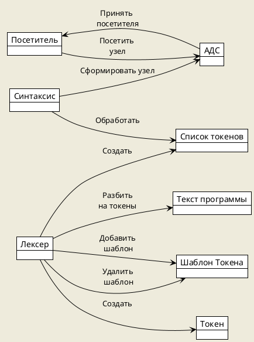
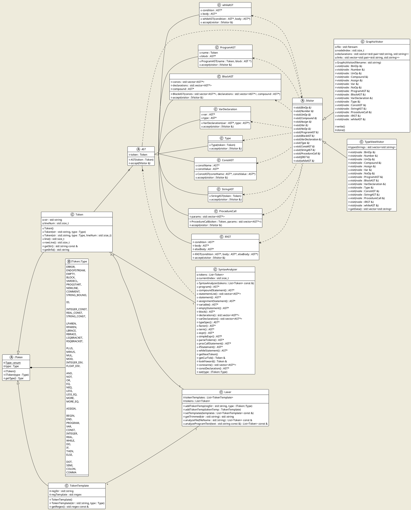

## Диаграмма объектов.

```plantuml
@startuml
    !theme plain
    skinparam backgroundColor #EEEBDC
    skinparam handwritten false
    skinparam arrowFontColor black
    left to right direction

    object "Лексер" as Lexer
    object "Текст программы" as Text
    object "Синтаксис" as Syntax
    object "Список токенов" as List
    object "АДС" as AST
    object "Посетитель" as Visitor

    object "Токен" as Token
    object "Шаблон Токена" as TokenTemp

    Lexer --> TokenTemp : "Добавить\n шаблон"
    Lexer --> TokenTemp : "Удалить\n шаблон"
    Lexer --> Text : "Разбить\nна токены"
    Lexer --> List : "Создать"
    Lexer --> Token : "Создать"

    Syntax --> List : "Обработать"
    Syntax --> AST : "Сформировать узел"

    Visitor --> AST : "Посетить \nузел"
    Visitor <-- AST : "Принять \nпосетителя"
@enduml
```

## Диаграмма классов:

```plantuml
@startuml
    !theme plain
    skinparam backgroundColor #EEEBDC
    skinparam handwritten false
    skinparam arrowFontColor black
    skinparam groupInheritance 3
    left to right direction

    abstract "IToken" as IToken {
        -{static}Type : enum
        -type : Type
        + IToken()
        + IToken(type : Type)
        + {abstract} getType() : Type
    }

    enum "IToken::Type" as TokenType{
        ERROR,
        ENDOFSTREAM,
        EMPTY,
        BLOCK,
        VARDECL,
        PROGSTART,
        NEWLINE,
        COMMENT,
        STRING_BOUND,

        ID,

        INTEGER_CONST,
        REAL_CONST,
        STRING_CONST,

        LPAREN,
        RPAREN,
        LBRACE,
        RBRACE,
        LSQBRACKET,
        RSQBRACKET,

        PLUS,
        MINUS,
        MUL,
        MOD,
        INTEGER_DIV,
        FLOAT_DIV,

        AND,
        NOT,
        OR,
        EQ,
        NEQ,
        LESS,
        LESS_EQ,
        MORE,
        MORE_EQ,

        ASSIGN,

        BEGIN,
        END,
        PROGRAM,
        VAR,
        CONST,
        INTEGER,
        REAL,
        WHILE,
        DO,
        IF,
        THEN,
        ELSE,

        DOT,
        SEMI,
        COLON,
        COMMA
    }

    class "Token" as Token{
        +Token()
        +Token(str : std::string, type : Type)
        +Token(str : std::string, type : Type, lineNum : std::size_t)
        +line() : std::size_t
        + rowLine() : std::size_t
        + getStr() : std::string const &
        + getInfo() : std::string
        -str : std::string
        -lineNum : std::size_t
    }

    class "TokenTemplate" as TokenTemp{
        +TokenTemplate()
        +TokenTemplate(str : std::string, type : Type)
        + getRegex() : std::regex const &
        -regStr : std::string
        -regTemplate : std::regex
    }

    class "Lexer" as Lexer {
        +addTokenTemp(regStr : std::string, type : IToken::Type)
        +addTokenTemp(tokenTemp : TokenTemplate)
        +setTemplates(templates : List<TokenTemplate> const &)
        +getTrimmed(str : std::string) : std::string
        +analyzeFile(fileName : std::string) : List<Token> const &
        +analyzeProgramText(text : std::string const &) : List<Token> const &
        -tokenTemplates : List<TokenTemplate>
        -tokens : List<Token>
    }

    abstract "AST" as AST {
        +AST(token : Token)
        +{abstract}accept(IVisitor &)
        +token : Token
    }

    abstract "IVisitor" as IVisitor {
        +{abstract} visit(BinOp &)
        +{abstract} visit(Number &)
        +{abstract} visit(UnOp &)
        +{abstract} visit(Compound &)
        +{abstract} visit(Assign &)
        +{abstract} visit(Var &)
        +{abstract} visit(NoOp &)
        +{abstract} visit(ProgramAST &)
        +{abstract} visit(BlockAST &)
        +{abstract} visit(VarDeclaration &)
        +{abstract} visit(Type &)
        +{abstract} visit(ConstAST &)
        +{abstract} visit(StringAST &)
        +{abstract} visit(ProcedureCall &)
        +{abstract} visit(ifAST &)
        +{abstract} visit(whileAST &)
    }

    class "SyntaxAnalyzer" as Syntax {
        +SyntaxAnalyzer(tokens : List<Token> const &)
        +program() : AST*
        +compoundStatement() : AST*
        +statementList() : std::vector<AST*>
        +statement() : AST*
        +assignmentStatement() : AST*
        +variable() : AST*
        +emptyStatement() : AST*
        +block() : AST*
        +declarations() : std::vector<AST*>
        +varDeclaration() : std::vector<AST*>
        +typeSpec() : AST*
        +factor() : AST*
        +term() : AST*
        +expr() : AST*
        +simpleExpr() : AST*
        +parseTokens() : AST*
        +procCallStatement() : AST*
        +ifStatement() : AST*
        +whileStatement() : AST*
        +getNextToken()
        +getCurTok() : Token &
        +lookFoward() : Token &
        +constants() : std::vector<AST*>
        +constDeclaration() : AST*
        +eat(type : IToken::Type)

        -tokens : List<Token>
        -currentIndex : std::size_t
    }

    class ProgramAST{
        +ProgramAST(name : Token, block : AST *)
        +accept(visitor : IVisitor &)

        +name : Token
        +block : AST*
    }

    class BlockAST{
        +BlockAST(consts : std::vector<AST*>, declarations : std::vector<AST*>, compound : AST*)
        +accept(visitor : IVisitor &)

        +consts : std::vector<AST*>
        +declarations : std::vector<AST*>
        +compound : AST*
    }

    class VarDeclaration{
        +VarDeclaration(var : AST*, type : AST*)
        +accept(visitor : IVisitor &)

        +var : AST*
        +type : AST*
    }

    class Type{
        +Type(token : Token)
        +accept(visitor : IVisitor &)
    }

    class ConstAST{
        +ConstAST(constName : AST*, constValue : AST*)
        +accept(visitor : IVisitor &)

        +constName : AST*
        +constValue : AST*
    }

    class StringAST{
        +StringAST(token : Token)
        +accept(visitor : IVisitor &)
    }

    class ProcedureCall{
        +ProcedureCall(token : Token, params : std::vector<AST*>)
        +accept(visitor : IVisitor &)

        +params : std::vector<AST*>
    }

    class ifAST{
        +ifAST(condition : AST*, body : AST*, elseBody : AST*)
        +accept(visitor : IVisitor &)

        +condition : AST*
        +body : AST*
        +elseBody : AST*
    }

    class whileAST{
        +whileAST(condition : AST*, body : AST*)
        +accept(visitor : IVisitor &)

        +condition : AST*
        +body : AST*
    }

    class GraphizVisitor{
        +GraphizVisitor(filename : std::string)
        +visit(node : BinOp &)
        +visit(node : Number &)
        +visit(node : UnOp &)
        +visit(node : Compound &)
        +visit(node : Assign &)
        +visit(node : Var &)
        +visit(node : NoOp &)
        +visit(node : ProgramAST &)
        +visit(node : BlockAST &)
        +visit(node : VarDeclaration &)
        +visit(node : Type &)
        +visit(node : ConstAST &)
        +visit(node : StringAST &)
        +visit(node : ProcedureCall &)
        +visit(node : ifAST &)
        +visit(node : whileAST &)

        +write()
        -done()

        -file : std::fstream
        -nodeIndex : std::size_t
        -declarations : std::vector<std::pair<std::string, std::string>>
        -links : std::vector<std::pair<std::string, std::string>>
    }

    class TypeViewVisitor{
        +visit(node : BinOp &)
        +visit(node : Number &)
        +visit(node : UnOp &)
        +visit(node : Compound &)
        +visit(node : Assign &)
        +visit(node : Var &)
        +visit(node : NoOp &)
        +visit(node : ProgramAST &)
        +visit(node : BlockAST &)
        +visit(node : VarDeclaration &)
        +visit(node : Type &)
        +visit(node : ConstAST &)
        +visit(node : StringAST &)
        +visit(node : ProcedureCall &)
        +visit(node : ifAST &)
        +visit(node : whileAST &)
        +getData() : std::vector<std::string>

        -typesStrings : std::vector<std::string>
    }

    IToken <|-- Token
    IToken <|-- TokenTemp
    IToken *-- TokenType

    TokenTemp "*" --- "1" Lexer
    Token "*" --- "1" Lexer

    AST <|.. ProgramAST
    AST <|.. BlockAST
    AST <|.. VarDeclaration
    AST <|.. Type
    AST <|.. ConstAST
    AST <|.. StringAST
    AST <|.. ProcedureCall
    AST <|.. ifAST
    AST <|.. whileAST

    AST o-up- Token

    IVisitor <.. AST

    ProgramAST <.. IVisitor
    BlockAST <.. IVisitor
    VarDeclaration <.. IVisitor
    Type <.. IVisitor
    ConstAST <.. IVisitor
    StringAST <.. IVisitor
    ProcedureCall <.. IVisitor
    ifAST <.. IVisitor
    whileAST <.. IVisitor

    AST <.. Syntax
    Token "*" --- "1" Syntax

    IVisitor <|-- GraphizVisitor
    IVisitor <|-- TypeViewVisitor
@enduml
```