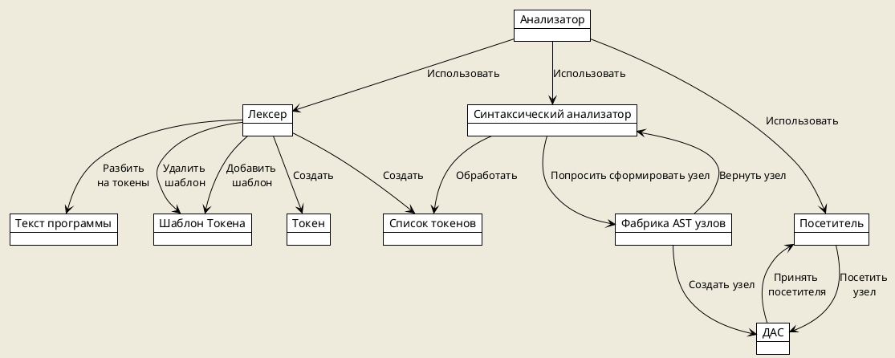

```plantuml
@startuml
    !theme plain
    skinparam backgroundColor #EEEBDC
    skinparam handwritten false
    skinparam arrowFontColor black
    'left to right direction

    object "Лексер" as Lexer
    object "Текст программы" as Text
    object "Синтаксический анализатор" as Syntax
    object "Анализатор" as Analyzer
    object "Список токенов" as List
    object "ДАС" as AST
    object "Посетитель" as Visitor

    object "Токен" as Token
    object "Шаблон Токена" as TokenTemp

    object "Фабрика AST узлов" as ASTFactory

    Lexer --> TokenTemp : "Добавить\n шаблон"
    Lexer --> TokenTemp : "Удалить\n шаблон"
    Lexer --> Text : "Разбить\nна токены"
    Lexer --> List : "Создать"
    Lexer --> Token : "Создать"

    Syntax --> List : "Обработать"
    Syntax --> ASTFactory : "Попросить сформировать узел"
    ASTFactory --> AST : "Создать узел"
    ASTFactory --> Syntax : "Вернуть узел"

    Visitor --> AST : "Посетить \nузел"
    Visitor <-- AST : "Принять \nпосетителя"
    Lexer <-UP- Analyzer : "Использовать"
    Syntax <-UP- Analyzer : "Использовать"
    Visitor <-UP- Analyzer : "Использовать"
@enduml
```